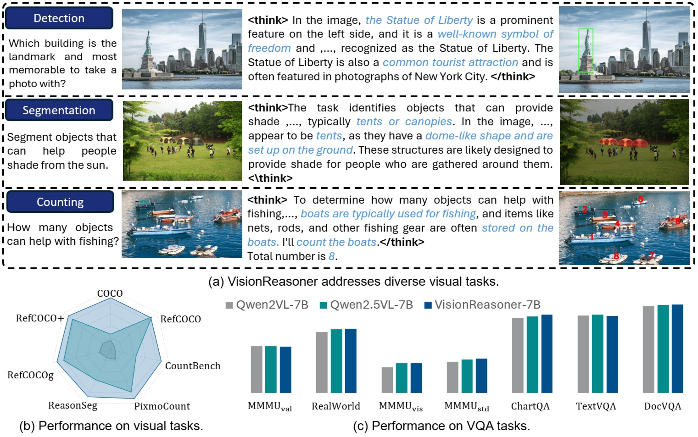
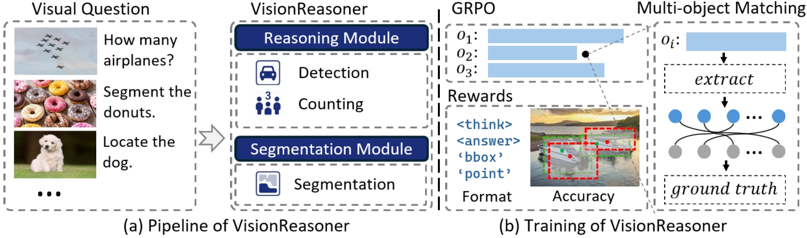

# Vision-Manus: Solving Hundreds of Vision Tasks with One Assistant

<!-- Paper: [📖 Vision-Manus](https://arxiv.org/abs/2503.06520)   
HuggingFace Daily: [🤗 Seg-Zero](https://huggingface.co/papers/2503.06520)   -->
Model: [🤗 Vision-Manus-7B](https://huggingface.co/Ricky06662/Seg-Zero-7B) 

Overview of Vision-Manus:

<div align=center>

</div>

Vision-Manus demonstrates following features:
1. With a task router and a core cognition model, Vision-Manus can deal with hundreds of vision tasks. 
2. Vision-Manus includes a task router that convert hundreds of vision tasks into several abstract tasks, followed by a core cognition model that deal with abstract tasks. 
3. Currently, we support four abstract tasks: 2D object detection, 2D object segmentation, object counting, VQA. More supported tasks and more abstract tasks are coming, such as 3D or medical image processing.


## News

[April 19th, 2025] 🔥 Vision-Manus is coming! We have released the inference code.


## Contents
- [Model](#model)
- [Examples](#examples)
- [Installation](#installation)
- [Inference](#inference)
- [Training](#training)
- [Citation](#citation)
- [Acknowledgement](#acknowledgement)


## Model
<div align=center>

</div>

Vision-Manus includes a task router that convert hundreds of vision tasks into several abstract tasks, followed by a core cognition model that deal with abstract tasks. 


## Examples

<div align=center>

</div>


## Installation

```bash
git clone https://github.com/dvlab-research/Vision-Manus.git
cd Vision-Manus
conda create -n vision_manus python=3.12
conda activate vision_manus
pip3 install torch torchvision torchaudio
pip install -r requirements
pip install sam2
pip install matplotlib
```


## Inference
```bash
python inference_scripts/infer_vision_manus.py
```
The default question is 
> "the unusal object in the image."

You will get the thinking process in command line, like:

> "The image shows a bicycle with wheels that have been replaced with large, round objects resembling watermelon slices. The unusual aspect of the image is the substitution of the bicycle wheels with these watermelon-like objects, which is not a typical feature of a bicycle. The rest of the bicycle appears to be a standard design, but the wheels are the focal point of the image."

And the mask will be presented in **inference_scripts** folder. 

<div align=center>

</div>

You can also provide your own image_path and text by:
```bash
python inference_scripts/infer.py --image_path "your_image_path" --text "your question text"
```


## Training

[TO BE UPDATED] For the core cognitive model, we recommand you to [Seg-Zero](https://github.com/dvlab-research/Seg-Zero) for training details. 

> [!NOTE]
> Currently, the training environment is different from Vision Manus.     


## Citation

```bibtex
@article{liu2025segzero,
  title        = {Seg-Zero: Reasoning-Chain Guided  Segmentation via Cognitive Reinforcement},
  author       = {Liu, Yuqi and Peng, Bohao and Zhong, Zhisheng and Yue, Zihao and Lu, Fanbin and Yu, Bei and Jia, Jiaya},
  journal      = {arXiv preprint arXiv:2503.06520},
  year         = {2025}
}

```

## Acknowledgement
We would like to thank the following repos for their great work: 

- This work is built upon the [Seg-Zero](https://github.com/dvlab-research/Seg-Zero), [EasyR1](https://github.com/hiyouga/EasyR1) and [veRL](https://github.com/volcengine/verl).
- This work utilizes models from  [Qwen2-VL](https://huggingface.co/Qwen/Qwen2-VL-2B-Instruct), [Qwen2.5-VL](https://huggingface.co/Qwen/Qwen2.5-VL-3B-Instruct) and [SAM2](https://huggingface.co/facebook/sam2-hiera-large). 


## Star History

<!-- [](https://star-history.com/#dvlab-research/Seg-Zero&Date) -->