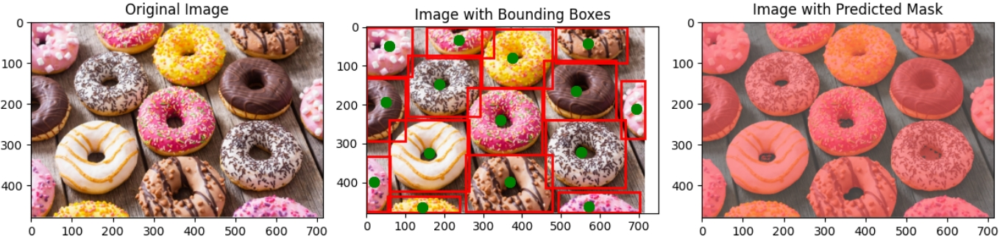

# Vision-Manus: Solving Dozens of Vision Tasks with One Assistant  

> Current VLMs are primarily used for visual captioning or visual QA tasks. In this project, we take a step further by demonstrating the potential of a single VLM to solve dozens of diverse vision tasks. We hope this work will advance the frontier of VLM research and expand the boundaries of what these models can achieve.  

> "A new era of VLM is coming. This is just the beginning..."    

<!-- Paper: [📖 Vision-Manus](https://arxiv.org/abs/2503.06520)   
HuggingFace Daily: [🤗 Seg-Zero](https://huggingface.co/papers/2503.06520)   -->
Model: [🤗 Vision-Manus-7B](https://huggingface.co/Ricky06662/Seg-Zero-7B) 

Overview of Vision-Manus:

<div align=center>

</div>

Vision-Manus demonstrates following features:
1. **Vision-Manus** has a task router module and a core cognitive module, it can deal with dozens of vision tasks within one model. 
2. The task router module can convert dozens of vision tasks into limited abstract tasks.  The a core cognitive module can deal with abstract tasks and output final results.  
3. We have supported dozens of visual tasks in the [Papers With Code](https://paperswithcode.com/datasets?mod=images&page=1), although it may not be the best performance. Please refer to [supported tasks](supported_tasks.md) for details. These tasks are categoried as four abstract tasks: detection, segmentation, counting and VQA. More supported tasks and more abstract tasks are coming, such as 3D or medical image processing.  
4. We select several representative tasks and propose the composite evaluation benchmark, **General-Visual-Bench**, to evaluate models general visual ability. This benchmark includes detection tasks (e.g., [COCO](https://cocodataset.org/#home), [RefCOCOg](https://github.com/lichengunc/refer)), segmentation tasks (e.g., [ReasonSeg](https://github.com/dvlab-research/LISA)), counting tasks (e.g., [CountBench](https://teaching-clip-to-count.github.io/)) and VQA tasks (e.g. [DocVQA](https://www.docvqa.org/)).


## News

<!-- [April 22th] We have released the training codes of Vision Manus. Please refer to [Seg-Zero](https://github.com/dvlab-research/Seg-Zero) for details.  -->
[April 19th, 2025] 🔥 Vision-Manus is coming! Vision-Manus is based on our previous [Seg-Zero](https://github.com/dvlab-research/Seg-Zero).  


## Contents
- [Model](#model)
- [Installation](#installation)
- [Inference](#inference)
- [Evaluation](#evaluation)
- [Training](#training)
- [Citation](#citation)
- [Acknowledgement](#acknowledgement)


## Model
<div align=center>

</div>

Vision-Manus includes a task router module that convert dozens of vision tasks into several abstract tasks, followed by a core cognition module that deal with abstract tasks and output final results.  


<!-- ## Examples

<div align=center>

</div> -->


## Installation

```bash
git clone https://github.com/dvlab-research/Vision-Manus.git
cd Vision-Manus
conda create -n vision_manus python=3.12
conda activate vision_manus
pip3 install torch torchvision
pip install -r requirements.txt
```


## Inference
```bash
python inference_scripts/infer_vision_manus.py
```
### The default task is a counting task.  
> "How many airplanes are there in this image?"

<div align=center>

</div>


You will get the thinking process in command line, like:

> "The image shows a formation of airplanes flying in the sky. The planes are arranged in a specific pattern, and there are visible smoke trails behind them. The task is to count the number of airplanes in the image and identify their bounding boxes. The planes are evenly spaced, and the formation appears to be symmetrical. The bounding boxes will be around the planes themselves, not the smoke trails."

And you will get the final answer in command line, like:

> "Total number of interested objects is:  10"


### You can also try a detection / segmentation task by:  
```bash
python inference_scripts/infer.py --image_path "assets/donuts.png" --text "please segment the donuts"
```

You will get the thinking process in command line, like:

> "The task is to segment the donuts in the image. The goal is to identify the individual donuts and their bounding boxes. The donuts are of various colors and toppings, and they are arranged on a wooden surface. The bounding boxes will help in identifying the donuts and their positions relative to each other. The donuts are clearly separated, and the bounding boxes can be drawn around each donut based on their visible edges and shapes."

And the results will be presented in **inference_scripts** folder. 

<div align=center>

</div>

### Or some tasks that need reasoning: 

```bash
python inference_scripts/infer.py --image_path "assets/stand_higher.png" --text "find what can make the woman stand higher?"
```

You will get the thinking process in command line, like:

> " The woman is standing on a ladder, which is used to make her stand higher. The ladder is positioned against the side of the house, allowing her to reach the upper part of the wall. The ladder is the object that can make the woman stand higher, as it elevates her position relative to the ground."

And the results will be presented in **inference_scripts** folder. 

<div align=center>

</div>


### We also support naive visual QA / captioning task:
```bash
python inference_scripts/infer.py --image_path "assets/company_name.png" --text "What is name of the company?"
``` 

> "What is name of the company?"
<div align=center>

</div>

You will get the final answer in command line, like:

> "The answer is:  ITC"

### You can also provide your own image_path and text by:
```bash
python inference_scripts/infer.py --image_path "your_image_path" --text "your question text"
```

## Evaluation

Please refer to evaluation_scripts folders for details. 

For example, use this script to evaluate ReasonSeg dataset.

```bash 
bash evaluation_scripts/eval_reasonseg.sh
``` 


## Training

[TO BE UPDATED] For the core cognitive module, we recommand you to [Seg-Zero](https://github.com/dvlab-research/Seg-Zero) for training details. 

> [!NOTE]
> Currently, the training environment is different from Vision Manus. And the training codes are to be updated.      


## Citation

```bibtex
@article{liu2025segzero,
  title        = {Seg-Zero: Reasoning-Chain Guided  Segmentation via Cognitive Reinforcement},
  author       = {Liu, Yuqi and Peng, Bohao and Zhong, Zhisheng and Yue, Zihao and Lu, Fanbin and Yu, Bei and Jia, Jiaya},
  journal      = {arXiv preprint arXiv:2503.06520},
  year         = {2025}
}

@misc{liu2025visionmanus,
  title        = {Vision-Manus: Solving Dozens of Vision Tasks with One Assistant},
  author       = {Liu, Yuqi and Qu, Tianyuan and Liu, Shu},
  howpublished = {\url{https://github.com/dvlab-research/Vision-Manus}},
  year         = {2025}
}
```

## Acknowledgement
We would like to thank the following repos for their great work: 

- This work is built upon the [Seg-Zero](https://github.com/dvlab-research/Seg-Zero), [EasyR1](https://github.com/hiyouga/EasyR1) and [veRL](https://github.com/volcengine/verl).
- This work utilizes models from  [Qwen2-VL](https://huggingface.co/Qwen/Qwen2-VL-2B-Instruct), [Qwen2.5-VL](https://huggingface.co/Qwen/Qwen2.5-VL-3B-Instruct) and [SAM2](https://huggingface.co/facebook/sam2-hiera-large). 


## Star History

<!-- [](https://star-history.com/#dvlab-research/Seg-Zero&Date) -->